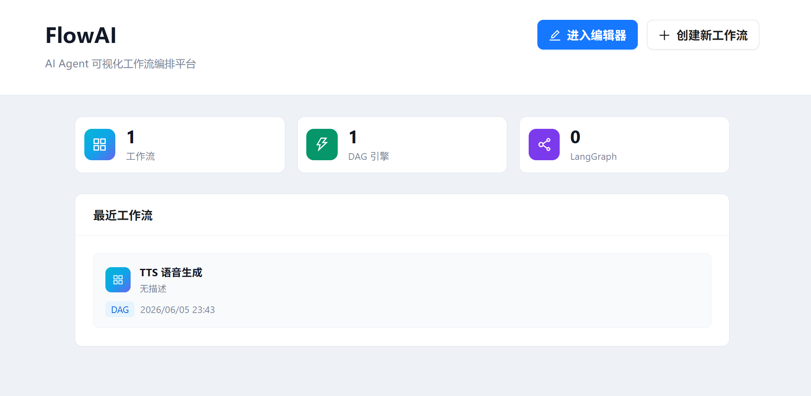
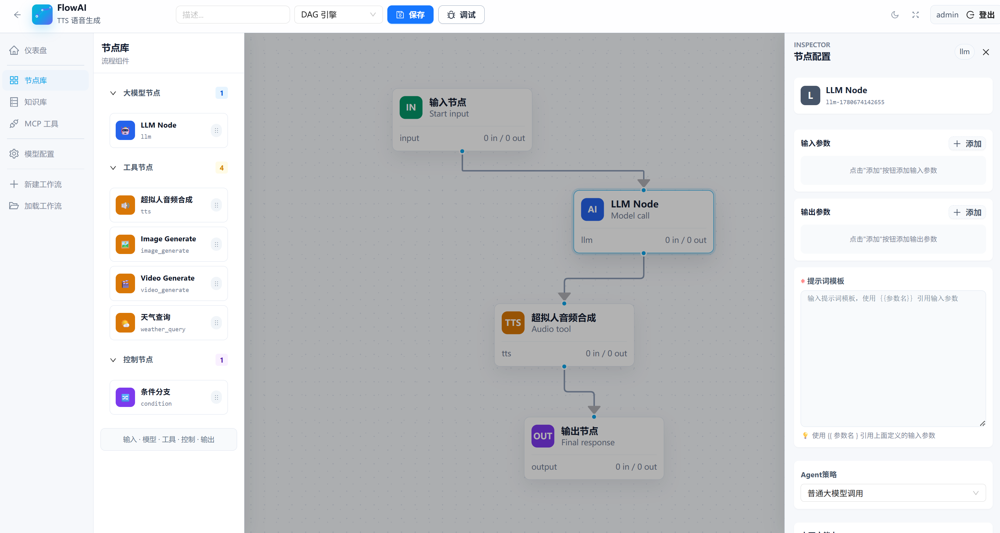

<div align="center">

# FlowAI

**企业级 AI 工作流可视化编排平台**

通过拖拽式界面快速构建、编排和执行 AI 工作流

[](LICENSE)
[](https://www.python.org/)
[](https://fastapi.tiangolo.com/)
[](https://www.langchain.com/)
[](https://github.com/langchain-ai/langgraph)
[](https://reactjs.org/)
[](https://www.typescriptlang.org/)

[快速开始](#-快速开始) • [功能特性](#-核心特性) • [技术架构](#-技术架构)

</div>

---

## 项目简介

FlowAI 是一个**企业级的 AI 工作流可视化编排平台**，通过直观的拖拽式界面快速构建复杂的 AI 处理流程。

### 为什么选择 FlowAI？

- **零代码编排** — 可视化拖拽界面，无需编程即可构建复杂 AI 工作流
- **双引擎驱动** — 自研 DAG 引擎 + LangGraph 状态图引擎，按需切换
- **多模型统一** — 基于 LangChain，统一接入 OpenAI、DeepSeek、通义千问等主流大模型
- **Skills 技能系统** — 内置提示词工程技能框架，YAML 声明式定义
- **Python 原生** — 充分利用 LangChain/LangGraph 生态
- **实时调试** — 调试面板 + SSE 流式输出，可视化执行过程
- **IDE 风格前端** — 暗色主题、侧边栏导航、全屏模式



---

## 核心特性

### 可视化流程编辑器

基于 ReactFlow 构建的专业流程图编辑器，支持节点拖拽、连线配置、参数编辑。



### 多大模型节点支持

基于 **LangChain + OpenAI 兼容协议** 统一接入：OpenAI、DeepSeek、通义千问、阶跃星辰、智谱 AI 等。

### 工具节点生态

ReAct Agent、Web Search、Web Fetch、TTS 音频合成、图片/视频生成、知识库检索、长期记忆、条件分支等。

### DAG + LangGraph 双引擎

- **DAG**: Kahn 算法拓扑排序 + DFS 环检测 + 断点续执行
- **LangGraph**: Python 原生 StateGraph，支持条件分支和循环

---

## 技术架构

```
┌─────────────────────────────────────────────────────────┐
│               前端 (Frontend)                              │
│  React 18 + TypeScript + ReactFlow + Ant Design 6        │
│  Docker: nginx:alpine (端口 3000)                         │
└────────────────────┬────────────────────────────────────┘
                     │ REST API / SSE
┌────────────────────┴────────────────────────────────────┐
│               后端 (Backend)                               │
│      FastAPI + Python 3.13 + SQLAlchemy (端口 8084)       │
│      Docker: python:3.13-slim + uvicorn                  │
└────────────────────┬────────────────────────────────────┘
                     │
┌────────────────────┴────────────────────────────────────┐
│             核心引擎 (Engine)                               │
│  EngineSelector → DAG Engine / LangGraph Engine           │
│  NodeExecutorFactory → 23 个节点执行器                     │
│  SkillRegistry → 三级渐进式技能加载                        │
└────────────────────┬────────────────────────────────────┘
                     │
┌────────────────────┴────────────────────────────────────┐
│              AI 模型层 (LangChain)                          │
│  ChatOpenAI + 多厂商 base_url 适配                         │
└────────────────────┬────────────────────────────────────┘
                     │
┌────────────────────┴────────────────────────────────────┐
│              数据层 (Docker)                                │
│  MySQL 8.0 (3308) | Redis 7 (6380) | MinIO (9002)       │
└─────────────────────────────────────────────────────────┘
```

---

## 项目结构

```
FlowAI/
├── docker-compose.yml              # 全部服务编排
├── .env                            # 公共环境变量
├── backend/
│   ├── Dockerfile                  # 后端镜像
│   ├── docker-entrypoint.sh        # 启动脚本 (等待DB → 迁移 → 启动)
│   ├── main.py                     # FastAPI 入口
│   ├── app/
│   │   ├── config.py               # pydantic-settings (FLOWAGENT_ 前缀)
│   │   ├── database.py             # async SQLAlchemy 引擎
│   │   ├── dependencies.py         # DI (get_db, get_current_user)
│   │   ├── models/                 # 17 个 SQLAlchemy 模型
│   │   ├── schemas/                # Pydantic 请求/响应 schema
│   │   ├── api/                    # 9 个路由模块, 39 个端点
│   │   ├── services/               # 业务逻辑层
│   │   └── engine/                 # 工作流执行引擎
│   │       ├── dag_engine.py       # DAG 引擎
│   │       ├── langgraph_engine.py # LangGraph 引擎
│   │       ├── engine_selector.py  # 双引擎路由
│   │       └── node_executor/      # 23 个节点执行器
│   ├── tests/                      # pytest 单元测试
│   └── alembic/                    # 数据库迁移
├── frontend/
│   ├── Dockerfile                  # 前端镜像 (多阶段: node build + nginx)
│   ├── nginx.conf                  # SPA路由 + /api 反向代理
│   ├── src/
│   │   ├── pages/                  # 仪表盘 / 编辑器 / 知识库 / MCP
│   │   ├── components/             # 画布 / 节点面板 / 调试面板
│   │   ├── api/                    # API 层
│   │   ├── store/                  # Zustand 状态管理
│   │   └── hooks/                  # 暗色模式等 hooks
│   └── public/
└── skills/                         # 技能定义
```

---

## 快速开始

### 方式一：Docker 一键部署（推荐）

```bash
# 1. 克隆项目
git clone https://github.com/June18th/FlowAI.git
cd FlowAI

# 2. 配置环境变量（可选，默认值即可运行）
cp .env.example .env

# 3. 一键启动全部服务
docker compose up -d
```

访问 `http://localhost:3000`，默认账户 `admin / admin123`。

### 方式二：本地开发

#### 环境要求

| 工具 | 版本 | 说明 |
|------|------|------|
| Python | 3.13+ | 后端运行时 |
| Node.js | 18+ | 前端构建 |
| Docker | 最新版 | 运行 MySQL/Redis/MinIO |

#### 1. 启动 Docker 服务

```bash
docker compose up -d mysql redis minio
```

#### 2. 配置环境变量

```bash
cd backend
cp ../.env.example .env
```

#### 3. 安装依赖并迁移

```bash
pip install -e .
alembic upgrade head
```

#### 4. 启动后端

```bash
python main.py                      # 端口 8084
```

#### 5. 启动前端

```bash
cd frontend
npm install && npm run dev          # 端口 5173
```

#### 6. 登录

用户名 `admin`，密码 `admin123`

---

## API 端点总览 (39 个)

| # | 方法 | 路径 | 说明 |
|---|------|------|------|
| 1 | GET | `/health` | 健康检查 (MySQL/Redis) |
| 2-5 | POST/GET | `/api/v1/auth/*` | 登录/登出/刷新/当前用户 |
| 6-10 | CRUD | `/api/v1/workflows` | 工作流增删改查 + 分页 |
| 11-16 | POST/GET | `/api/v1/workflows/{id}/executions/**` | 执行/SSE流/快照/变量/续执行 |
| 17 | GET | `/api/v1/node-types` | 节点类型列表 |
| 18-24 | CRUD | `/api/v1/llm-config/**` | LLM 配置管理 |
| 25-30 | CRUD | `/api/v1/mcp-tools/**` | MCP 工具管理 |
| 31-33 | GET | `/api/v1/skills/**` | 技能管理 |
| 34-39 | CRUD | `/api/v1/knowledge-bases/**` | 知识库管理 |

---

## 许可证

MIT License
